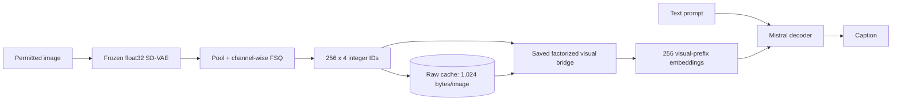

# Single-stream SUVI deployment on Arm64

SUVI's Phase 3 decoder path is single-stream: the decoder receives one
sequence of visual-prefix embeddings followed by the text prompt. It does not
run a CLIP/ViT tower or a cross-attention projector in the request path.

## Request paths

| Path | Online components | Visual representation |
| --- | --- | --- |
| Uncached | image preprocessing, SD-VAE, pooling, FSQ, bridge, Mistral decoder | freshly derived FSQ IDs |
| Cached | raw ID read, bridge, Mistral decoder | the same validated FSQ IDs |

The cache stores `256 × 4` uint8 IDs, or 1,024 bytes per image. Cached and
uncached requests produce identical visual prefixes and caption token IDs.
